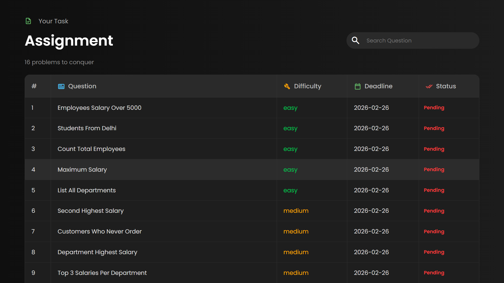
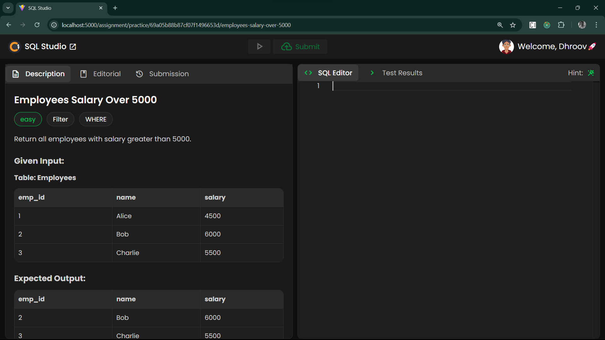
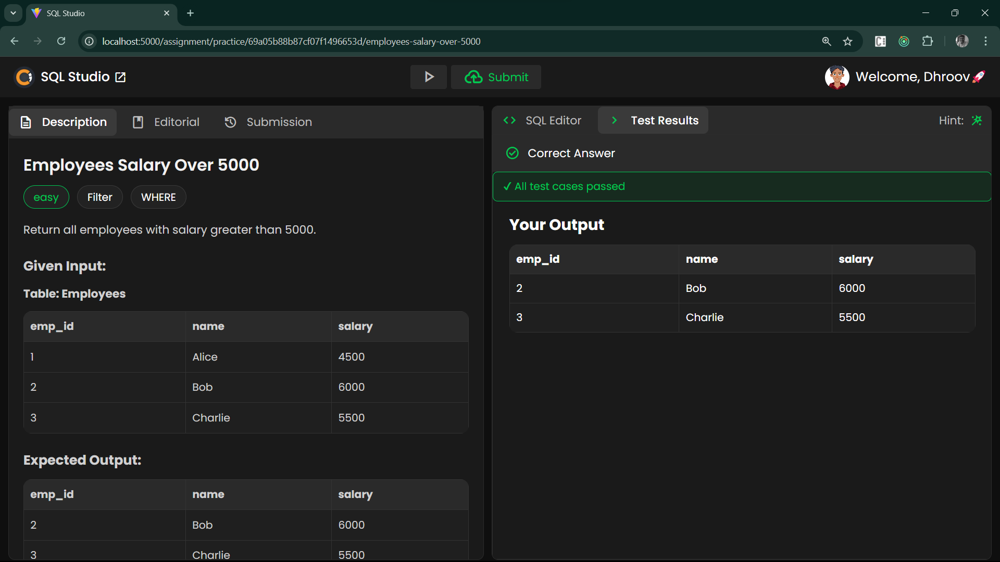
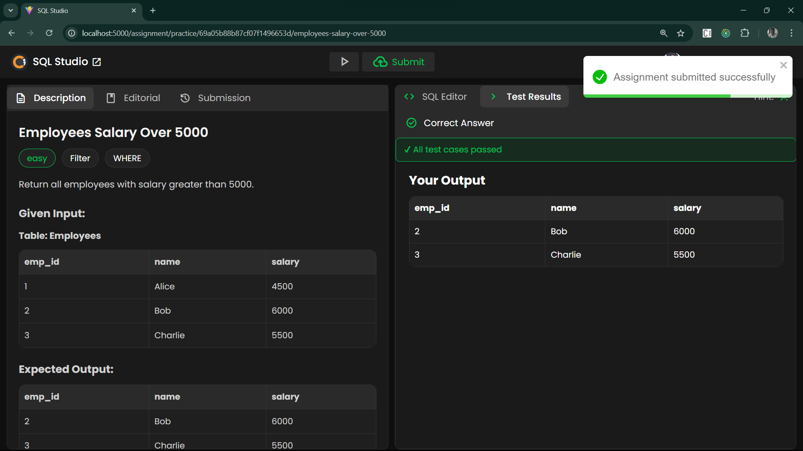
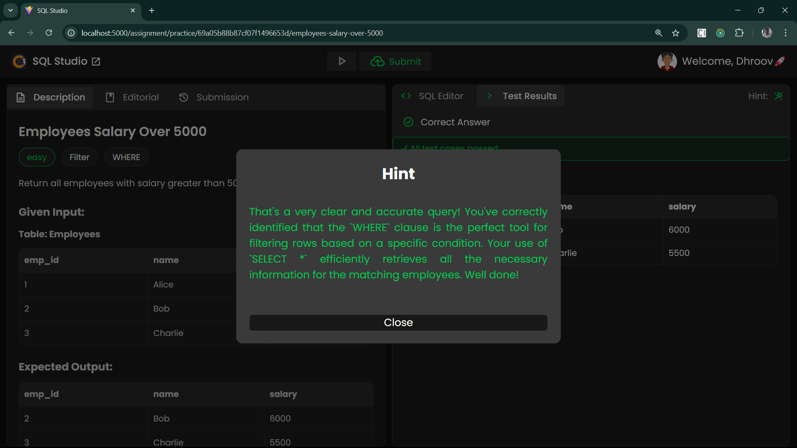

# 🗄️ CIPHER SCHOOLS - SQL Studio Assignment

A full-stack SQL learning platform with a built-in Monaco editor, test cases, AI hints, and assignment tracking.

**Disclaimer:**
This project is currently under construction. It is build as a motive of assignment. It may possess bugs and i apologise for that, but i am working on it...

....Trying to give you best experience. 
Thank you, 
Regards,
Rahul

---

## Some Glimpse of the project








## 🚀 Tech Stack

| Layer     | Technology           |
| --------- | -------------------- |
| Frontend  | React + Vite         |
| Backend   | Node.js / Express    |
| Database  | PostgreSQL + MongoDB |
| Container | Docker + Compose     |

---

## 📦 Running with Docker

Make sure you have **Docker** and **Docker Compose** installed.

```bash
# Clone the repo
git clone https://github.com/luv-rahul/sql-studio
cd sql-studio

# Start all services
docker compose up --build
```

Once running, the services will be available at:

| Service    | URL                   |
| ---------- | --------------------- |
| Frontend   | http://localhost:5000 |
| Backend    | http://localhost:4000 |
| PostgreSQL | localhost:5432        |
| MongoDB    | localhost:27017       |

---

## 🐳 Docker Services Overview

```
sql-studio/
├── frontend      → React app         (port 5000)
├── backend       → Express API       (port 4000)
├── postgres      → PostgreSQL DB     (port 5432)
└── mongo         → MongoDB           (port 27017)
```

---

## ⚙️ Environment Variables

Create a `.env` file in the `backend/` directory:

```env
# Server
PORT=4000

# PostgreSQL
PG_HOST=postgres
PG_PORT=5432
PG_USER=your_pg_user
PG_PASSWORD=your_pg_password
PG_DATABASE=ciphersqlstudio

# MongoDB
MONGO_URI=mongodb://mongo:27017/ciphersqlstudio

# Auth / Session
JSON_WEB_TOKEN_SECRET_KEY=your_secret_key
GOOGLE_GENAI_KEY=your_secret_key
```

> ⚠️ Never commit your `.env` file. Add it to `.gitignore`.

---

## 🛑 Stopping the App

```bash
# Stop all containers
docker compose down

# Stop and remove volumes (wipes DB data)
docker compose down -v
```

---

## 🔄 Rebuilding After Changes

```bash
docker compose up --build
```

---

## 📁 Project Structure

```
sql-studio/
├── frontend/
│   ├── src/
│   │   ├── assets/
│   │   ├── components/
│   │   ├── features/
│   │   ├── slice/
│   │   ├── store/
│   │   └── utils/
│   │   └── App.jsx
│   │   └── index.css
│   │   └── main.jsx
│   └── Dockerfile
├── backend/
│   ├── config/
│   ├── controllers/
│   ├── middlewares/
│   ├── models/
│   ├── routes/
│   ├── services/
│   ├── utils/
│   ├── app.js/
│   └── Dockerfile
├── docker-compose.yml
└── README.md
```

---

## 🧠 Features

- 📝 Monaco SQL Editor with syntax highlighting
- ✅ Test case runner with pass/fail results
- 💡 AI-powered hints for assignments
- 📋 Assignment tracker with difficulty levels
- 🔐 Auth with session management

---

## 🐛 Common Issues

**Cannot connect to Postgres/Mongo?**
Use the service name (e.g., `postgres`, `mongo`) as the host inside Docker — not `localhost`.

**Port already in use?**

```bash
# Check what's using the port
lsof -i :5000
lsof -i :4000
```

---

## 👨‍💻 Author

Built with ❤️ — Rahul
